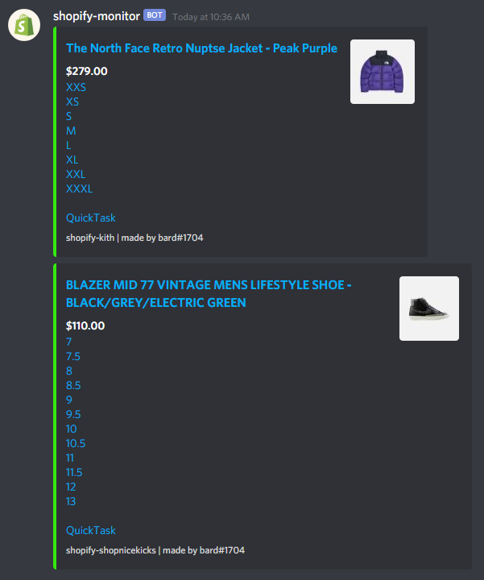

# shopify-monitor

<ul>
<li>This is a simple shopify monitor that I made in a couple hours</li>
<li>The notifications are sent to a discord server via user supplied webhook</li>
<li>Feel free to make changes, as there is plenty of room for improvements</li>
<li>The QuickTask is currently hardcoded for CyberAIO</li>
 
<li>You must add proxies to the proxies.txt file in order to avoid shopify temp bans</li>
 
</ul>

